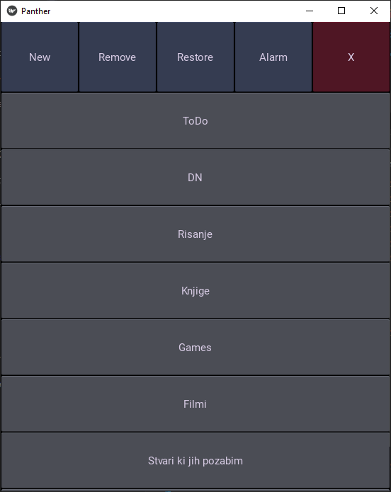
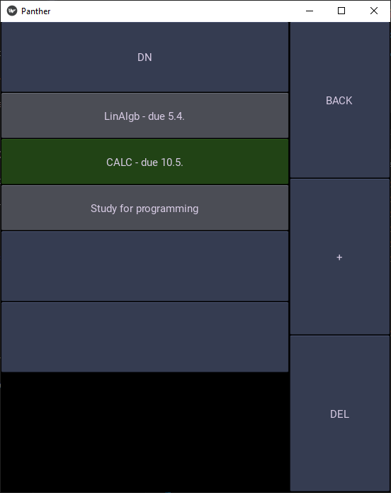
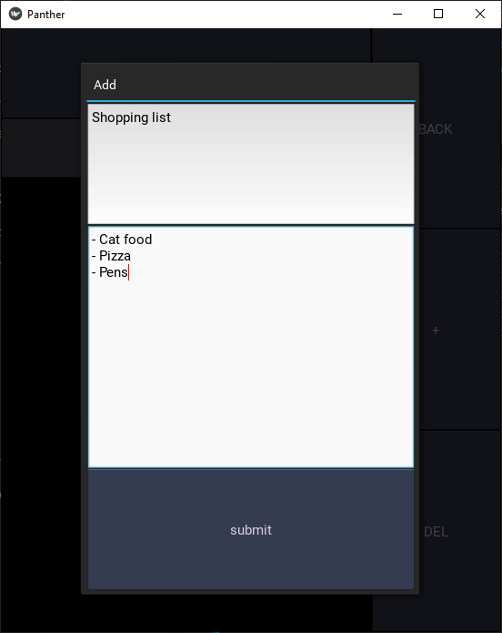
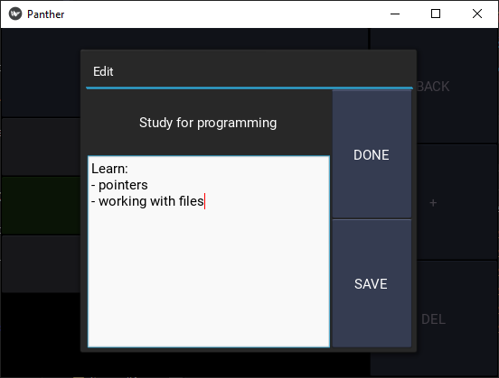

App for creating small notes. Created using python and kivy. It syncs data with an sql server, whose ip is saved in the ip.dat file. The purpose of this project was for me to learn how to organize around a larger project than what you would normally see in class. 

## Screenshots

